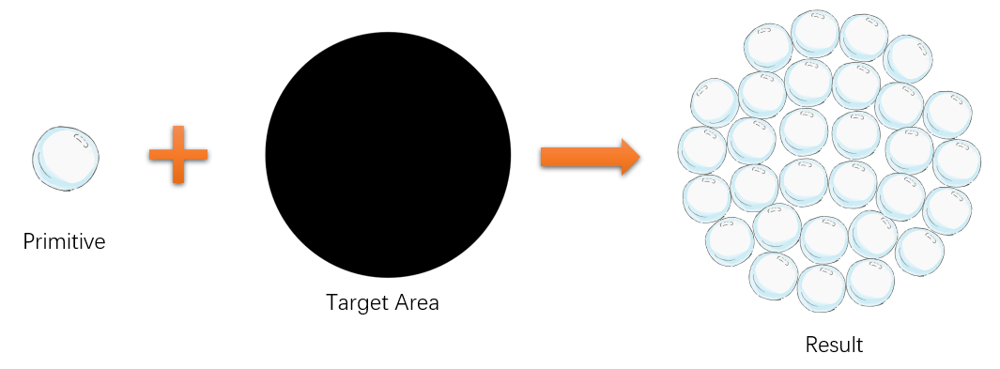

# Collage Demo —— DiffVG 应用示例

本文档以 `simple_collage` 为例，展示如何用 DiffVG 实现**可微分矢量拼贴优化**：将多个 SVG 图形自动排布到指定容器区域，通过梯度下降优化其位置、旋转和缩放。


---

## 1. 流程概览

```
outline_svg（轮廓提取） → main：轮廓初始化 → 前向传播（变换 + 渲染）→ 损失计算 → 反向传播 → 最终渲染
``` 

---

## 2. outline_svg：轮廓提取

`outline_svg` 对原始 primitive SVG 做预处理：统一尺寸、从二值图提取轮廓、拟合 DiffVG Path，并保存质心，供 collage 的 `main` 使用。

### 2.1 整体流程

```python
def outline_svg(device):
    primitive_files = glob.glob("./primitive/images/*.svg")  # 原始图形
    for i, primitive_file in enumerate(primitive_files):
        # 1. 统一尺寸 → uniform_{i}.svg
        shapes = uniform_size(primitive_file, ...)
        target_img = get_target_img(shapes)   # 渲染为二值图

        # 2. 从二值图提取轮廓并构造 Path
        path = init_shapes(target_img, num_segments=20)

        # 3. DiffVG 拟合轮廓（微调）
        svg_optimize_img(..., num_iters=10)   # 输出 outline_{i}.svg

        # 4. 计算质心面积并保存
        get_area_centroid(target_img, ...)    # 输出 {i}.json
```

### 2.2 轮廓提取核心：`init_shapes`

从二值图像中提取轮廓，并转为 DiffVG 的 `Path`：

```python
def init_shapes(image, num_segments=20):
    # Step 1: 二值化（黑 < 128 为前景）
    binary_image = np.array(image.convert('L'))
    binary_image = (binary_image < 128).astype(np.uint8) * 255

    # Step 2: 查找外轮廓
    contours, _ = cv2.findContours(binary_image, cv2.RETR_EXTERNAL, cv2.CHAIN_APPROX_NONE)

    # Step 3: 若轮廓断开为多个，逐步膨胀直到合并为单一轮廓
    kernel_size = 1
    while len(contours) > 1:
        kernel_size += 1
        kernel = np.ones((kernel_size, kernel_size), np.uint8)
        dilated_image = cv2.dilate(binary_image, kernel, iterations=1)
        contours, _ = cv2.findContours(dilated_image, cv2.RETR_EXTERNAL, cv2.CHAIN_APPROX_NONE)
    contour = contours[0]

    # Step 4: Douglas-Peucker 近似，将轮廓简化为 num_segments 个顶点
    epsilon = 0
    simplified_contour = [1] * 100  # 占位
    while len(simplified_contour) > num_segments:
        epsilon += 1
        simplified_contour = cv2.approxPolyDP(contour, epsilon, closed=True)

    # Step 5: 点数不足时，在最长边上递归插入中点
    if len(simplified_contour) < num_segments:
        simplified_contour = insert_point_to_longest_segment(simplified_contour[:, 0, :], num_segments)
    else:
        simplified_contour = simplified_contour[:, 0, :]

    # Step 6: 线段内插值，得到贝塞尔控制点（每段 2 个插值点）
    points = np.vstack((simplified_contour, simplified_contour[0]))
    points = insert_points_in_segments(points, num_interpolations=2)
    points = points[:-1]

    # Step 7: 构造 DiffVG Path（每段 cubic 贝塞尔，num_control_points=2）
    path = pydiffvg.Path(
        num_control_points=torch.LongTensor([2] * num_segments),
        points=torch.FloatTensor(points),
        stroke_width=torch.tensor(0.0),
        is_closed=True
    )
    return path
```

### 2.3 辅助函数说明

| 函数 | 作用 |
|------|------|
| `insert_point_to_longest_segment` | 在最长边上插入中点，直到顶点数达到 `num_segments` |
| `insert_points_in_segments` | 在相邻顶点间线性插值，生成贝塞尔控制点 |
| `uniform_size` | 将 SVG 归一化到固定尺寸并居中 |
| `get_area_centroid` | 用 `scipy.ndimage.center_of_mass` 计算质心，写入 JSON |

### 2.4 输出文件（供 main 使用）

| 文件 | 用途 |
|------|------|
| `outline_{i}.svg` | 简化轮廓 Path，用于 collage 优化时的可微渲染 |
| `uniform_{i}.svg` | 归一化后的原始图形，用于最终高质量输出 |
| `{i}.json` | 质心 `center_x`, `center_y`，用于旋转/缩放中心 |

---

## 3. 轮廓/图形初始化（main 内）

### 3.1 DiffVG 环境初始化

```python
def init_diffvg(device):
    """初始化 diffvg"""
    pydiffvg.set_device(device)
    pydiffvg.set_use_gpu(torch.cuda.is_available())
```

### 3.2 加载 SVG 轮廓与质心

从 outline SVG 读取路径轮廓，从 JSON 读取质心，用于后续围绕质心做平移/旋转/缩放：

```python
# 读取 outline SVG 中的 shapes
shapes = []
for outline_file in outline_files:
    _, _, svg_shapes, _ = pydiffvg.svg_to_scene(outline_file)
    shapes.append(svg_shapes[0])

# 从 JSON 读取质心
centroids = []
for json_file in json_files:
    with open(json_file, 'r') as file:
        data = json.load(file)
        centroids.append([data['center_x'], data['center_y']])

# 原始控制点（相对质心，便于后续变换）
raw_control_points_tensor = get_raw_control_points(shapes, centroids, device)
raw_control_points_tensor.requires_grad = False  # 轮廓本身不优化
```

### 3.3 基于网格的位置初始化

在容器轮廓内部用网格采样得到初始放置位置：

```python
def grid_based_sampling(contour, num_points, canvas_width, canvas_height):
    """在轮廓内部基于网格采样，可腐蚀收缩避免边缘"""
    x, y, w, h = cv2.boundingRect(contour)
    binary_img = np.zeros((canvas_height, canvas_width), dtype=np.uint8)
    cv2.drawContours(binary_img, [contour], -1, 255, -1)
    
    grid_size = int(np.sqrt(cv2.contourArea(contour) / num_points))
    # 形态学腐蚀收缩
    erosion_size = max(1, grid_size // 2)
    kernel = cv2.getStructuringElement(cv2.MORPH_ELLIPSE, (erosion_size*2+1, erosion_size*2+1))
    shrunk_img = cv2.erode(binary_img, kernel, iterations=1)
    # ... 在收缩区域内采样网格点 ...
    return points
```

### 3.4 可优化参数

- `pos_tensor`: 每个图形的位置 `(mark_num, 1, 2)`，`requires_grad=True`
- `angle_tensor`: 每个图形的旋转角 `(mark_num, 1)`，`requires_grad=True`
- `global_size`: 全局缩放因子，`requires_grad=True`
- `shape_groups`: 填充色、描边色等（此处固定）

```python
pos_tensor = torch.tensor(pos_data, dtype=torch.float32, device=device, requires_grad=True)
angle_tensor = torch.zeros((mark_num, 1), dtype=torch.float32, device=device, requires_grad=True)
global_size = torch.tensor(1.0, dtype=torch.float32, device=device, requires_grad=True)

shape_groups = [pydiffvg.ShapeGroup(
    shape_ids=torch.LongTensor([i]),
    fill_color=torch.FloatTensor([0, 0, 0, 0.3]),
    stroke_color=torch.FloatTensor([0, 0, 0, 0.3])
) for i in range(mark_num)]
```

---

## 4. 前向传播

### 4.1 仿射变换（缩放 → 旋转 → 平移）

每个迭代中，用可优化参数将原始控制点变换到画布坐标：

```python
# 缩放：原始控制点 * size * global_size
primitive_list1 = raw_control_points_tensor * size_tensor * global_size

# 旋转（绕质心）
points_2 = torch.zeros_like(primitive_list1, device=device)
points_2[:, :, 0] = primitive_list1[:, :, 0] * torch.cos(angle_tensor) - primitive_list1[:, :, 1] * torch.sin(angle_tensor)
points_2[:, :, 1] = primitive_list1[:, :, 0] * torch.sin(angle_tensor) + primitive_list1[:, :, 1] * torch.cos(angle_tensor)

# 平移
points_2 = points_2 + pos_tensor

# 更新 shape 的控制点
for i in range(mark_num):
    shapes[i].points = points_2[i]
```

### 4.2 DiffVG 可微分渲染

将 shapes 和 shape_groups 序列化后调用 DiffVG 的 `RenderFunction.apply`，得到可微分的栅格图像：

```python
def svg_to_img(shapes, shape_groups, width, height):
    scene_args = pydiffvg.RenderFunction.serialize_scene(
        width, height, shapes, shape_groups
    )
    _render = pydiffvg.RenderFunction.apply
    img = _render(
        width, height,
        2, 2,  # num_samples_x, num_samples_y
        0,     # seed
        None,
        *scene_args
    )
    # 白色背景合成
    para_bg = torch.tensor([1., 1., 1.], requires_grad=False, device=img.device)
    img = img[:, :, 3:4] * img[:, :, :3] + para_bg * (1 - img[:, :, 3:4])
    img = img.permute(2, 0, 1)  # HWC -> CHW
    return img
```

---

## 5. 损失计算

### 5.1 加权 MSE 损失

在目标区域（mask 内）更强调拟合目标图像：

```python
def weights_mse(mask, raster_img, target_img, scale=1):
    """加权 MSE：全局 + 掩码区域加权"""
    loss_mse = F.mse_loss(raster_img, target_img)
    mask_raster_img = mask * raster_img
    mask_target_img = mask * target_img
    loss_mse += F.mse_loss(mask_raster_img, mask_target_img) * 100
    return loss_mse * scale
```

### 5.2 排斥损失

抑制在白色背景区域（灰度 > 178/255）绘制，促使图形集中在黑色目标区域：

```python
def exclude_loss(raster_img, scale=1):
    """排斥损失：惩罚在亮区绘图"""
    img = F.relu(178/255 - raster_img)
    return torch.sum(img) * scale
```

### 5.3 总损失与反向传播

```python
loss_mse = weights_mse(mask_img, raster_img, target_img, scale=15e4)
loss_exclude = exclude_loss(raster_img, scale=0.8)
loss = loss_mse + loss_exclude

optimizer.zero_grad()
loss.backward()
optimizer.step()
```

---

## 6. 最终渲染

### 6.1 优化后参数

优化结束后，`pos_tensor`、`angle_tensor`、`global_size` 即为最优布局参数。

### 6.2 用原始高精度 SVG 重新生成

将优化参数应用到 `uniform_files` 中的原始 SVG（高分辨率轮廓），得到最终矢量结果：

```python
# 将优化后的参数移到 CPU
size_tensor_cpu = size_tensor.detach().cpu()
angle_tensor_cpu = angle_tensor.detach().cpu()
pos_tensor_cpu = pos_tensor.detach().cpu()
global_size_cpu = global_size.detach().cpu()

# 对每个图形应用变换
for i in range(mark_num):
    _, _, shapes, shape_groups = pydiffvg.svg_to_scene(uniform_files[i])
    for j, shape in enumerate(shapes):
        center = torch.tensor([data["center_x"], data["center_y"]], dtype=torch.float32)
        points_1 = (shape.points - center) * size_tensor_cpu[i, 0, 0] * global_size_cpu
        angle = angle_tensor_cpu[i, 0]
        points_2[:, 0] = points_1[:, 0] * torch.cos(angle) - points_1[:, 1] * torch.sin(angle)
        points_2[:, 1] = points_1[:, 0] * torch.sin(angle) + points_1[:, 1] * torch.cos(angle)
        points_2 = points_2 + pos_tensor_cpu[i, 0, :]
        shape.points = points_2
        # ... 收集 shapes1, shape_groups1 ...

pydiffvg.save_svg(f"{output_dir}/final/final_result.svg", render_size, render_size, shapes1, shape_groups1)
```

---

## 7. 小结

| 阶段       | 核心操作                                      |
|------------|-----------------------------------------------|
| outline_svg | 二值图 → findContours → approxPolyDP → 插值 → DiffVG Path；保存 outline/uniform/质心 |
| 初始化     | 加载 outline/uniform SVG、质心、容器 mask；网格采样初始位置 |
| 前向传播   | 仿射变换更新 `shape.points` → DiffVG 渲染得到 `raster_img` |
| 损失计算   | 加权 MSE + 排斥损失                            |
| 最终渲染   | 用优化参数变换原始 uniform SVG 并保存为 `final_result.svg` |

整体上，Collage Demo 展示了 DiffVG 的典型用法：**把 SVG 作为可微参数，通过渲染 → 损失 → 反向传播，优化矢量布局**。
